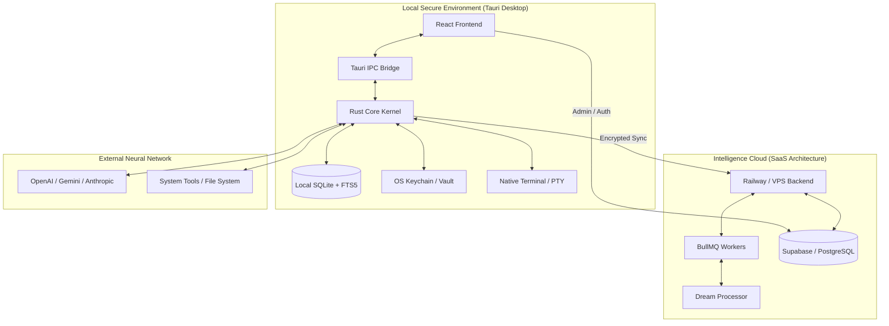

# ORAYA — MASTER ARCHITECTURE 🏗️

## 1. The Paradox: Local-First Cloud Power
Oraya is built on a "Privacy First, Intelligence Everywhere" philosophy. This manifests as a hybrid architecture that splits high-sensitivity operations from high-coordination tasks.

### Architecture Topology

## 2. Component Breakdown

### A. The Rust Kernel (`src-tauri/src`)
The "Brain" of Oraya. Unlike electron apps that carry massive overhead, Oraya uses a native Rust kernel for:
- **The Orchestrator**: A multi-turn autonomous tool execution loop (Max 25 turns).
- **Context Management**: 3-tier strategy (Assistant, Brainstorm, War Room).
- **Security Enforcer**: A strict Mode → Protocol → Tool permission chain.
- **PtyManager**: Real-time terminal session handling.

### B. The Cloud Layer (`Oraya Saas` + `VPS`)
Designed for cross-device persistence and heavy background lifting:
- **Supabase**: Handles multi-tenant Auth, Organization management, and Superadmin stats.
- **VPS (Rust API Server)**: A standalone version of the desktop kernel designed for always-on background tasks.
- **Workers**: High-performance jobs for "Dream State Processing" and large-scale knowledge graph indexing.

### C. The Sovereign Vault
Oraya's security is hardware-backed:
- **Hardware Integration**: Uses macOS Keychain / Windows Credential Manager.
- **AES-256-GCM**: Every API key and secret is encrypted with item-specific keys before hitting any storage.
- **Zero-trace (Ghost Protocol)**: Sessions designed to leave no artifacts on the host OS.

## 3. Why this System?

| Feature | Local Approach | SaaS Integration | Why? |
|---------|----------------|------------------|------|
| **Privacy** | 100% Data Sovereignty | Encrypted Metadata | Passwords never hit the cloud. Context stays edge-side. |
| **Speed** | IPC Latency < 1ms | Sync Latency ~100ms | Real-time tool execution requires native speed. |
| **Scale** | Desktop CPU power | VPS Worker scalability | Heavy indexing (Dreaming) can be offloaded when idle. |

## 4. Groundbreaking Decision: SQLite + FTS5
Oraya uses `SQLite` with `FTS5` for its "Memory Palace." This allows for instant semantic search cross-referenced with full-text matching, without the need for a persistent Vector DB (planned for Phase 2). It's a "RAG-lite" that works entirely offline.
