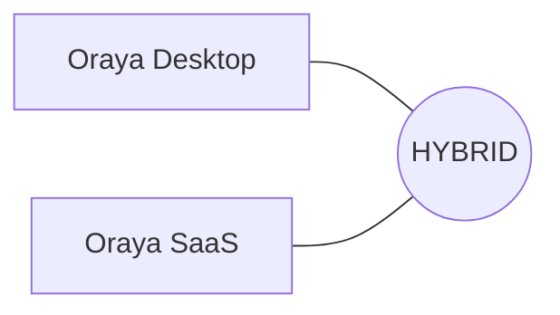

# ORAYA — PROJECT STRUCTURE MAP 🗺️

## 1. Global Repository Ecosystem
Oraya is split into two primary repositories representing the "Client Core" and the "SaaS Infrastructure."

## 2. Oraya (The Desktop Core)
Location: `/Users/anweshrath/Documents/Cursor/Neeva Pilot/Oraya/`

### A. The Rust Backend (`src-tauri/`)
- `src/main.rs`: The entry point. Initializes the state (The Loop).
- `src/ai/orchestrator.rs`: **[CORE]** The high-performance tool execution runner.
- `src/api/`: All IPC communication handlers (Conversations, Memory, Security).
- `src/security/`: **[THE BARK]** Enforcer logic for protocols L1-L5.
- `src/services/providers/`: Native integrations for Gemini, OpenAI, Claude.
- `src/tools/executors/macos/`: Natively written system controllers (File search, Terminal, Scheduling).

### B. The React Frontend (`src/`)
- `src/components/Chat/`: The primary chat interface (HUD style).
- `src/components/Terminal/`: Integration with `xterm.js`.
- `src/styles/themes.ts`: Source of truth for the Oraya design tokens.

### C. Background Infrastructure
- `oraya-worker/`: Standalone Node/Rust services for background jobs.
- `puppeteer-service/`: Web automation layer for RAG and site-scraping.

---

## 3. Oraya Saas (The Cloud Interface)
Location: `/Users/anweshrath/Documents/Cursor/Neeva Pilot/Oraya Saas/`

### A. The Next.js App (`app/`)
- `app/page.tsx`: The primary Sales/Landing page (PASTOR flow).
- `app/api/`: Serverless functions for Auth and Supabase interaction.
- `superadmin/`: Private dashboard for platform metrics (Active Orgs, Token Usage).

### B. Components (`components/`)
- `components/sales/`: Dedicated folder for the landing page's premium sections (NeuralBackground, TerminalDemo, StatsCounter).
- `components/theme/`: Shared theme provider logic.

### C. Data Layer (`supabase/`)
- `supabase/migrations/`: Unified source of truth for the PostgreSQL schema.
- `.env.local`: Connection strings for the production database.

## 4. Why the Split?
- **Speed**: The desktop app needs Rust/Native access for 1ms response times.
- **Privacy**: Local data (SQLite) stays on the machine.
- **Coordination**: The SaaS layer allows for "Brain Links" (Context sharing) and team subscriptions without compromising the local-first security of the individual developer.
